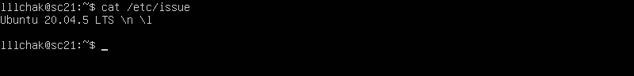

# Linux

## Task 1. OS Installation
```
First task was to install and configure Ubuntu 20.04 using virtual machine (using VirtualBox)
```
We can check if OS installed successfully running `cat /etc/issue` command.


## Task 2. Creating a user
```
Second task was to create a new user
```
To create a new user we can call `sudo useradd $USERNAME` command. After new user created we can check its data running `cat etc/passwd` command.


## Task 3. Setting up the OS network
```
Here we are to set up the OS network
```
- First we need to change machine's name to `user-1`. We can do it with `sudo hostnamectl set-hostname $HOSTNAME` command.


- Then we are to set up current timezone. To do it we can run `sudo timedatectl set-timezone $TIMEZONE` command.


- After timezone is setted up we can get network interfaces names running `ip -br link show` command.

IO - is a virtual interface included **by default** in any Linux. It is used to debug network programs and run server applications on a local machine. The address 127.0.0.1 is always associated with this interface. It has a dns name - localhost.

- Then we are to check machine's IP addres. We can do it running `ip a` command


- And get address from DHCP server (eliminates human error so that address conflicts, configuration errors, or simple typos are minimized) using `sudo dhclient -v enp0s3`.


- After we got address from DHCP server we can get internal and external gateway IP addresses running `wget -qO- eth0.me` (external) and `ip route | grep default` (internal) commands.


- To set static setting for IP, DNS and gw first we need to off DHCP. To do it simply change DHCP state and add static IPs in `/etc/netplan/00-installer-config.yaml`


    So now we got static IP, DNS and gw
    

- After running `ping $ADDRESS` command we got


